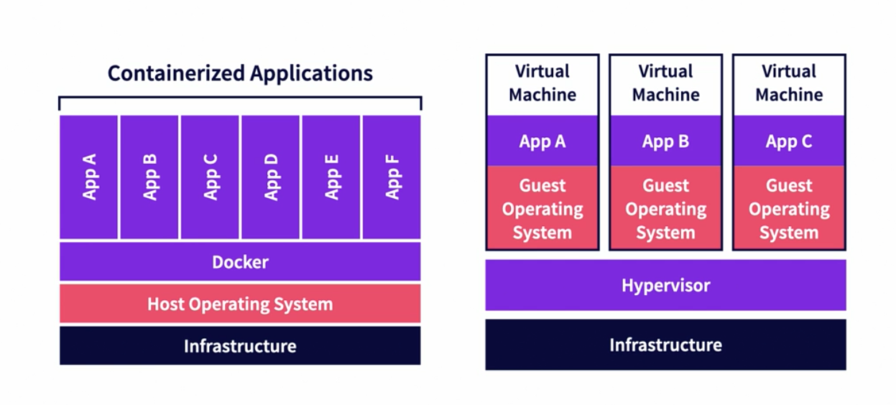

# Docker Explained

Docker uses images and containers to allow apps to run anywhere consistently.

## Previous Solutions

- Configuration Management Tools (Chef, Puppet and Ansible) these required knowledge aboud hardware and operating systems.

- Virtual machine as code (Vagrant) heavy, slow-ish, requires inconvenient configuration.

## Docker makes containers easy

1 - Configuration through Dockerfiles, not shell command.

2 - Share images with others through images registries. 

3 - A super easy command line client and API.

## What are Docker Containers not doing?

* Containers are not smaller Virtual Machines (VMs)



**Containers vs Virtual Machines**

**Containers**

- Run in containers runtimes.
- Work alongside operating systems.
- Do not required OS configuration.
- Run one app at a time. (usually)

**Virtual Machines**

- Run on top of hypervisors. 
- Need hardware emulations.
- Require OS configuration.
- Can run many apps at once. 

## Container runtimes

**How do containers even work?**

Container runtimes create, manage and delete containers.

Namespaces defines what resources containers can access. Control Group define how much of those resources containers can consume.

**Container runtimes automate all these with one command ```docker run```**

In the host:
- Mount a directory
- Unshare a namespace 
- Create a chroot pointed to de mounted directory.

In the namespace
- Create a control group and bind to PID within namespace.
- Set Linux capabilities on the chroot.
- Start application within the namespace. 

Container runtimes can:
- Create namespaces.
- Create and associate cgroups to namespaces (containers)
- Map filesystems to containers.
- Set container capabilities.
- Start, stop, and remove individual containers.

Cannot: 
- Build images.
- Pull images.
- Serve API for interacting with containers.

## OCI and CRI runtimes

Types of containers runtimes

**OCI** The Open Cointainer Initiative is a working group.

- OCI aims to standatize container technology like container images and runtimes.
- The OCI runtimes specification outlines what a container is and how they should be manage.
- runtime-spec does not dicate how to do these things 
- **runc** from docker is de facto industry standard runtime.

## The Docker Engine

Container Engine make managing containers easy. Including entire domain specific languages for configuring containers before they start. 

**Docker Engine**

- Most popular container engine.
- Come with the docker command line tools.
- Also comes with a REST-API managing containers and a DSL for creating container images called **Dockerfile**
- Use a **Containerd** as its runtime by default. 

## Where are Docker's configuration files?

- /var/lib/docker/ : containers, volumes, and metadata used by docker client and runtime.
- /var/lib/docker/overlay/ : container volumes stora data from containers while they're running.
- /var/run/docker.sock : the pipe between the Docker Client and Docker Engine. Unix Socket live there. 
- /etc/docker/deamon.json : Docker Engine Configuration (Might not exist at first) , HTTP proxies and runtime configuration. 


